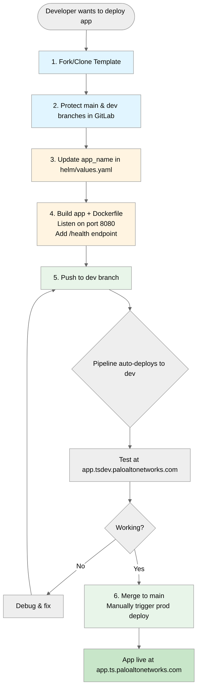
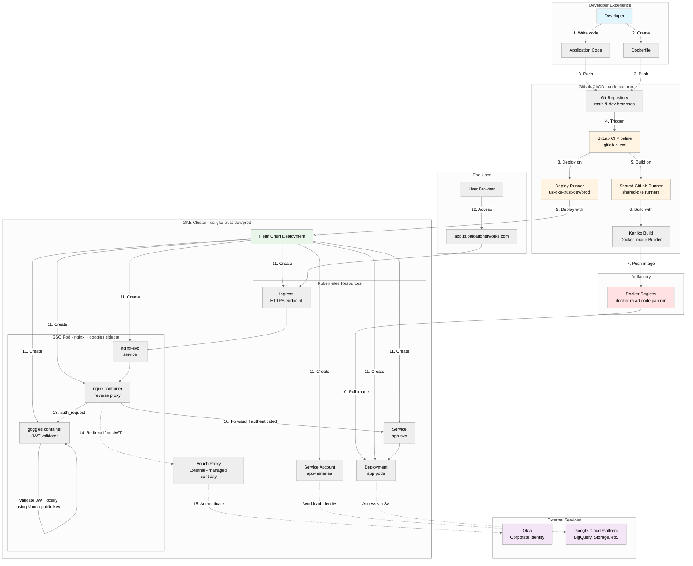
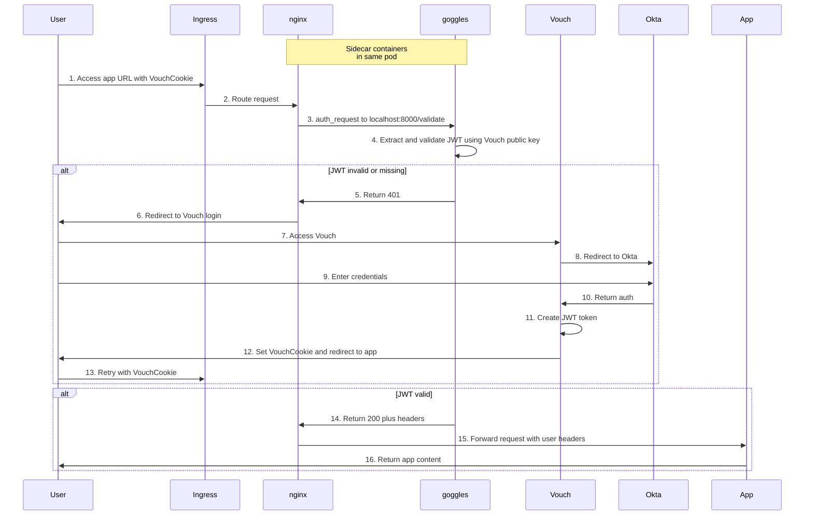
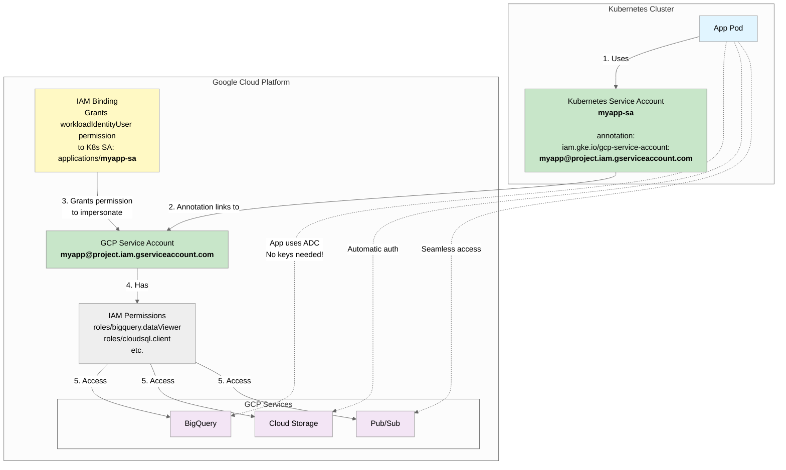
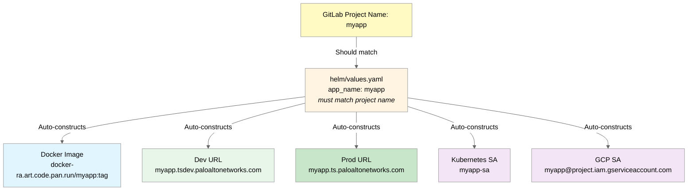
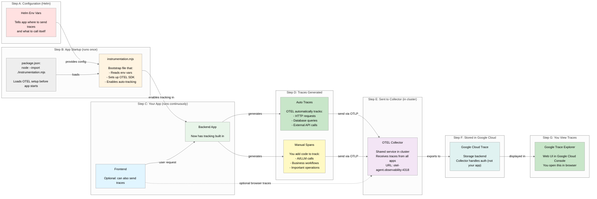

# App Template Architecture Diagrams

Visual diagrams for understanding the app-template infrastructure and workflow.

## 1. Developer Workflow - 6 Steps to Production

## 2. System Architecture - All Components

## 3. CI/CD Pipeline Flow - From Code to Production

```mermaid
%%{init: {'theme':'neutral', 'themeVariables': { 'fontSize':'16px'}}}%%
flowchart LR
    subgraph "Code Push"
        Push[Developer pushes to dev or main]
    end
    
    subgraph "GitLab Pipeline Stages"
        Security[Security Scan<br/>Sentinel - secrets detection]
        Build[Build Docker Image<br/>Kaniko on shared runner]
        Publish[Publish to Artifactory<br/>docker-ra.art.code.pan.run]
        DeployDev[Deploy to Dev<br/>Auto on dev branch]
        DeployProd[Deploy to Prod<br/>Manual on main branch]
    end
    
    subgraph "Deployment Process"
        HelmDev[Helm upgrade on dev cluster<br/>us-gke-trust-dev runner]
        HelmProd[Helm upgrade on prod cluster<br/>us-gke-trust-prod runner]
    end
    
    subgraph "Kubernetes Cluster"
        Pods[Pods running with new image]
        Health[Health checks<br/>/health endpoint]
    end
    
    Push --> Security
    Security --> Build
    Build --> Publish
    Publish --> DeployDev
    Publish --> DeployProd
    DeployDev --> HelmDev
    DeployProd --> HelmProd
    HelmDev --> Pods
    HelmProd --> Pods
    Pods --> Health
    
    style Push fill:#e1f5ff
    style Security fill:#fff4e1
    style Build fill:#fff4e1
    style Publish fill:#ffe1e1
    style DeployDev fill:#e8f5e9
    style DeployProd fill:#ffccbc
    style HelmDev fill:#e8f5e9
    style HelmProd fill:#ffccbc
    style Pods fill:#c8e6c9
```

## 4. Authentication Flow - SSO with Okta

## 5. Google Cloud Access - Workload Identity

## 6. Configuration - Single Source of Truth

## 7. Observability - OpenTelemetry Tracing

**For full explanation and setup guide, see [TELEMETRY-SETUP.md](TELEMETRY-SETUP.md).**

---

## Executive Summary

**Problem:**
- Every new app requires 2-3 days of expert Kubernetes/GitLab work
- Steep learning curve for developers
- Inconsistent deployments across teams
- SSO and GCP access are manual, error-prone processes

**Solution:**
- Pre-built template with all infrastructure
- 30 minutes from code to production
- Single configuration point (app_name)
- Automatic SSO, GCP access, CI/CD, environments

**Impact:**
- 90% time reduction (3 days → 30 minutes)
- Democratizes deployment (no Kubernetes expertise needed)
- Standardized, secure deployments
- Developers focus on code, not infrastructure
